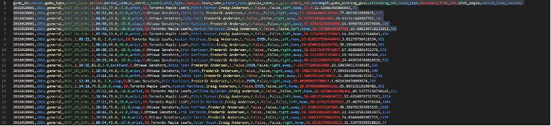

    COMMENT **Fill in this part and add an introduction to the blog. Let's try to tell a story**


# **Data Acquisition**
- A small Python package `nhl_pbp` that:
  1. **Discovers** game IDs per season across all teams,
  2. **Fetches** PBP JSON for each game (with retries & polite pauses),
  3. **Caches** raw JSON to disk (so reruns are fast),
  4. **Converts** cached JSON → per-game CSVs, with an optional **merged per-season** CSV,
  5. Exposes both a **Python class** (for notebooks) and a **CLI** (for batch runs).
- Everything is **reproducible**: stable folder layout, env-driven settings, and a manifest option.
## Question 1: How to download data
- **Write a brief tutorial on how your team downloaded the dataset.**\
We use the NHL web API (base `https://api-web.nhle.com/v1`):

- **Season schedule / game discovery**
  `/v1/club-schedule-season/{TEAM_TRICODE}/{SEASON}`
  We loop all teams in the season, collect game IDs, and de-duplicate.

- **Play-by-play per game**
  `/v1/gamecenter/{GAME_ID}/play-by-play`

Note: the old Stats API endpoint (`/api/v1/game/{game_id}/feed/live`) is unreliable/retired, so we use the newer web API above (confirmed with the TA).

- **Include your function/class, and provide an example of using it.** Please ensure you’re not just demonstrating that your functionality works - this is also an exercise in documenting and communicating your implementation. It does not need to be extremely complicated, but we expect something slightly more coherent and digestible than just screenshots of your functions/code.


#### 1.1 Install & configure

  COMMENT : This does not print correctly in Jekyll
  
Environment & configuration
Optional env (defaults live in `config.py`):
| Var                 | Meaning                        | Example    |
| ------------------- | ------------------------------ | ---------- |
| `NHL_CACHE_DIR`     | Root folder for raw JSON cache | `nhl/raw` |
| `NHL_REQUEST_PAUSE` | Sleep between requests (sec)   | `0.25`     |
| `NHL_TIMEOUT_SEC`   | HTTP timeout (sec)             | `20`       |
| `NHL_MAX_RETRIES`   | Retries on 5xx/429             | `5`        |
| `NHL_PROGRESS`      | 1=show tqdm, 0=hide            | `1`        |

Dependencies:
```bash
pip install requests python-dotenv tqdm pandas pyarrow
```

#### 1.2 Our class & function
```python
# nhl_pbp/downloader.py (orchestrator)
class NHLPBPDownloader:
    """
    Download & cache NHL play-by-play using the new NHL web API.

    Methods
    -------
    list_game_ids_for_season(season_start_year, include_regular=True, include_playoffs=True, progress=SHOW_PROGRESS) -> List[int]
    fetch_and_cache_pbp(game_id: int, force=False) -> Dict[str, Any]
    download_season(season_start_year, include_regular=True, include_playoffs=True, limit=None, progress=SHOW_PROGRESS) -> List[int]
    write_manifest(season_start_year, out_csv_path) -> int
    """
```
---
```python
# nhl_pbp/fetch.py (single-game fetch, cache-aware)
def fetch_and_cache_pbp(game_id: int, force: bool=False) -> Dict[str, Any]:
    """
    GET /v1/gamecenter/{game_id}/play-by-play.
    If cached and force=False -> read; else GET and cache.
    """
```
---
#### 1.3 Python API — end-to-end example
```python

from nhl_pbp.downloader import NHLPBPDownloader
from nhl_pbp.fetch import fetch_and_cache_pbp
from nhl_pbp.transform import season_jsons_to_csvs_via_cache

dl = NHLPBPDownloader()

# 1) Discover game IDs (regular + playoffs)
game_ids = dl.list_game_ids_for_season(2016, include_regular=True, include_playoffs=True, progress=True)
print("Found", len(game_ids), "games:", game_ids[:5])

# 2) Fetch one game to cache (reuses cache on rerun)
pbp = fetch_and_cache_pbp(2017020001, force=False)

# 3) Cache a whole season (limit=None for full season)
ids = dl.download_season(2016, include_regular=True, include_playoffs=True, limit=None, progress=True)

# 4) Convert cached JSON -> CSVs (+ optional merged per-season CSV)
rows = season_jsons_to_csvs_via_cache(
    season_start_year=2016,
    out_dir="nhl/csv/2016-2017",
    merged_out_path="nhl/csv/2016-2017_events.csv"
)
print("Total rows written:", rows)
```
---
#### 1.4 CLI — batch runs from the shell
```python
# list IDs (regular + playoffs if neither flag given)
python -m nhl_pbp ids 2016 --regular --playoffs

# one season (smoke test with limits)
python -m nhl_pbp season 2016 --limit 50

# multiple seasons (inclusive)
python -m nhl_pbp seasons --start 2016 --end 2023 --regular --playoffs

# full pipeline: download + convert + merged per-season CSVs
python -m nhl_pbp pipeline --start 2016 --end 2023 \
  --out-dir-base nhl/csv \
  --merged-base  nhl/csv
```
#### 1.5 Schema we write (after transformation from json --> csv)
```json
["game_id","season","game_type","event_type","period","period_time",
 "x_coord","y_coord","shot_type","team_id","team_name","player_name","goalie_name"]
```
**Download sample (10 regular + 10 playoffs, 2016–17):**




**Convert cached JSON → CSVs (per-game + merged):**




**Processed CSVs (`nhl/csv/2016-2017/` + merged):**




**Preview of merged CSV (`2016-2017_events.csv`):**


## Sources / references

- Community **NHL Web API** reference (endpoints & examples). ([GitHub](https://github.com/Zmalski/NHL-API-Reference))
- Threads pointing to **club-schedule-season** for season-wide game discovery. ([Reddit](https://www.reddit.com/r/hockey/comments/17skeu2/created_some_reference_documentation_for_the_new/))
- **Play-by-play** via `gamecenter/{GAME_ID}/play-by-play`. ([Medium](https://medium.com/%40vtashlikovich/nhl-api-what-data-is-exposed-and-how-to-analyse-it-with-python-745fcd6838c2))
- Legacy StatsAPI doc (for understanding the **10-digit game ID** format). ([about.gitlab.com](https://gitlab.com/dword4/nhlapi/-/blob/master/stats-api.md))

# **Interactive Debugging Tool**
## Question 2: Our Interactive Debugging Tool

For our project, our team built an interactive tool to help us explore and understand NHL play-by-play data. It's like a custom dashboard that lets anyone on the team dig into the specifics of any game.

**What We Built**\
The interface has a three key parts.

•	**Dropdown Menus**: We can select a season (from 2016 to 2023), the type of game (regular season or playoffs), and then a specific game from that season.

•	**Event Slider**: A slider lets us scroll through every single event in the selected game, one by one.

•	**Three-Panel Display**:

1.	**Ice Rink Diagram**: A drawing of a hockey rink where events are plotted. We color-coded them: blue dots for shots and red stars for goals.
2.	**Full Event List**: A simple list showing all the events for the game, just like in the raw data.
3.	**Selected Event Details**: A box that shows all the info for the event we currently have selected, like the players involved, coordinates, and our calculated distance to the net.




- *Figure 2.1 - An overview of the interactive debugging tool showing event "14", a "wrist" shot taken by Toronto Mapple Leaf's Auston Mathews in the first period of the match against Senators that took place in 2019 (left). The image on the right shows the coordinate locations for all 136 events of that match (shots-on-goal and goals).*


**Why We Built It**\
The main purpose was to act as a debugging tool for the team. While working with the NHL data, we needed a way to check if our calculations (like mapping coordinates or calculating shot distances) were actually correct. Seeing the events on a rink makes it much easier to spot mistakes compared to just looking at numbers in a spreadsheet.

**A Big Challenge We Faced**\
One of the trickiest parts was calculating precise shot distances. The NHL data gives us the (x, y) coordinates of a shot, but it doesn't tell us which net the player was shooting at! This is a real problem for shots taken near center ice, where it's unclear which goal the player was targeting.

**Our Solution (And Its Limitation)**\
To solve this, we implemented a team-period approach. Basically, we look at where most of a team's shots come from in a single period and assume that's the net they are attacking. 


# **Tidy Data**
## Question 4.1 : Dataframe Example and Strength Analysis




- *Figure 4.1 presents a screenshot of a sample of our CSV columns after transforming the raw JSON files.*


**How We Could Add Strength Information**\
To track game situations like 5-on-4 power plays or 5-on-3, our team discussed a few ideas. We would need to:

1.	**Track Penalties**: Follow penalty events to know exactly when a player is in the penalty box.
2.	**Use Shift Data**: If we had it, we could count how many players are actually on the ice for each team at any given moment.
3.	**Combine Game Context**: By putting penalty and faceoff data together, we could reconstruct the game state to know if a shot was taken during an even-strength or special teams situation.


This would be a great next step, as it would require us to work with more event types beyond just shots and goals.


## Question 4.2 : Potential Additional Features

Our team brainstormed several new features we could build to get more insight from the data. Here are our top three ideas:

**Rebound Detection**

-	The Idea: Automatically identify shots that are rebounds from a previous save or miss.
-	How We'd Do It: We would look for sequences where the same team takes another shot very quickly (e.g., within 2-3 seconds) after the first one.
-	Why It's Useful: Rebounds are high-danger scoring chances. Flagging them would help us measure which teams and players are best at creating and converting on these second opportunities.


**Rush Chance Identification**

-	The Idea: Detect shots that happen right after a team enters the offensive zone, catching the defense off-guard.
-	How We'd Do It: We would look for shots that occur within a short time window (e.g., 4-5 seconds) after a recorded zone entry or a turnover at the blue line.
-	Why It's Useful: This would help us analyze a team's speed and effectiveness in transition, separating "rush" chances from set offensive plays.


**Shot Quality Assessment**

-	The Idea: Create a single metric that estimates how dangerous any given shot is.
-	How We'd Do It: We would build a model that combines several factors: the shot's distance from the net, the angle to the center of the goal, the type of shot (wrist, slap, etc.), and maybe the game situation.
-	Why It's Useful: Not all shots are created equal. This would move us beyond just counting shots and let us analyze the quality of scoring chances, which is a much better predictor of success.


# **Simple Visualizations**
## Question 5.1: Shot Types (Season 2020-2021)

For this exercice, we choose the season with most recorded events, the 2021-2022 season. The objective is to vizualize in a single figure the relationship between the number of shots, their type (wrist, snap, slap, backhand, tip-in, deflected, wrap-around). Contrary to the instructions, we chose to visualize the success rate of shots (e.g. the rate of goals per shots) instead of the number of goals, since the significant difference between "wrist" and the other categories would  obscure the reading of the figure.




- *Figure 5.1 presents the distribution of different shot types in the 2021–2022 season. The total number of shots per type (bars) is compared to the goal rate for each type (%, markers). We observe that the 'Wrist' shot is by far the most common, while the 'Tip-in' has the highest scoring rate.*


The figure was chosen to convey with a glance the total number of shots and identify the most common type. The bars have been sorted by decreasing goal rate values, to also make easier to identify the most "successful" type of shots. "Tip-in" and "deflected" appear as the most efficient shots, though uncommon. For further discussion on the most "dangerous" type see figures 5.3a and 5.3b.


## Question 5.2: Distances, Shots and Goals

For this exercice, distances are grouped into 10-ft bins (e.g., 0–10, 10–20) and were computed as the Euclidean distance between each shot’s (x,y) location and each team's net for each period. We chose to present a single figure for all three seasons to compare changes in trends over time.




- *Figure 5.2 compares the volume of shots by distance from the net (shot/total shots) (left) with the ratio of goals by distance (goals/shot) (right).*


Across seasons, the distributions of shots and goals are stable, except for the very rare defensive-zone attempts (shots taken from beyond ~90 ft). These vary by season and show higher goal rates than the neutral zone. We interpret those shots as "empty-net". In all seasons, goal probability rises as shots are taken closer to the net, though attempts within ~6 ft are rare. The most effective zone is approximately 6–18 ft, where both shot volume and goal rate are high.


## Question 5.3: Dangerous Shots and Expected Goals

For consistency, we continue working with the 2021-2022 season (see Figure 5.1).




- *Figure 5.3a shows the goal rate (goals / shots) for each shot type at each distance (bottom), alongside the share of shots, i.e. shots / total shots (top).*

 The most  "dangerous” shots are close-range "deflect", followed by close-range "tip-in" and long-range "snap" shots. However, these shots are extremely rare (each <0.03% of all shots), so their practical impact is limited. To give a more realistic picture, Figure 5.3b adds a view of dangerous shots and expected goals taking in consideration their total volume, highlighting type–distance combinations that are both sufficiently common and have strong scoring rates.




- *Figure 5.3b presents the most "expected" shot types by distance, to make very effective and uncommon shots less visible*

An alternative figure is proposed for this exercice to account for shot types that have a very high goal rate in certain zones, yet are very uncommon, such as "Deflected" within 0-5 feet. In Figure 5.3a, these shots/zones are most visible, yet in reality they happen at very rare ocassions. For Figure 5.3b, we understand as "dangerous", shots that are both effective and common and thus are the most "expected" for goals. Darker zones indicate higher danger, combining both a larger number of shots from that zone and a higher goal rate for the specific type. The z-metric was calculated as: z = goal_rate × (shot_share)^α, where 0 < α < 1. The exponent α was introduced to account for the unbalanced distribution of shot types (See Figure 5.1).


We observe that the most expected goals come "Wrist" shots taken from within 5–25 ft. "Tip-in", "Snap", and "Backhand" are also dangerous, though from different distance zones for each type.  At longer distances, "Slap", "Snap" and "Wrist" shots are the only that seem effective. "Empty-net" goals taken from a distance over 90ft are not expected due to their very few number. The least common and expected goal type is the "Wrap-around".

# **Advanced Vizualisations: Shot Maps**

## Question 6.1: Importing Plots


   COMMENT : add a small caption for the figure
- *Figure 6.1...*

## Question 6.2: Plot Interpretations

Figure 6.1s show a heatmap of a team’s excess shot rates for a given season, overlaid on the offensive side of an NHL rink. This allows us to see where the team is over-shooting or under-shooting relative to the league average for that season. The visualization also provides insights into the team’s offensive strategy. In the hands of an actual NHL team, the plots could indicate areas where the defense should focus to limit high-danger chances against a certain opponent.

## Question 6.3: Colorado Avalanche

During the 2016-2017 season, the Colorado Avalanche tended to take fewer shots from the high-danger area in front of the net compared to the league average and more shots from the flanks. This suggests that their offense relied more on perimeter shooting rather than taking chances from close range. This might indicate a need to improve net-front presence to increase scoring opportunities.

During the 2020-2021 season, Colorado Avalanche seem to have changed their offensive style. They seem to be taking a lot of shot opportunities in front of the net and also in other areas. We conclude that they have adapted a more aggressive playstyle, which explains their strong performance in the standings in this season compared to the 2016-2017 season.


## Question 6.4: Buffalo Sabers and Tempa Bay Lightning

The Buffalo Sabres show weak offensive activity across all three seasons (2018–19, 2019–20, 2020–21). In 2018–19, they already under-shoot the high-danger area in front of the net and rely more on low-percentage perimeter shots from the flanks, particularly the right side. In the following seasons, their shot maps show even larger blue regions, meaning they are generating fewer shots than the league average overall. This lack of offensive pressure, especially from dangerous scoring areas, helps explain their ongoing struggles and poor results in the standings.

The Tampa Bay Lightning, in contrast, display a consistent offensive effort. Their heatmaps show high shot generation from the slot and mid-range areas (10–20 feet from the net), which are high-probability scoring locations. Even if they don't always shoot a lot directly in front of the net, they still create pressure in dangerous zones. This suggests strong offensive systems, and players who can generate quality chances.

The Lightning’s success can reasonably be linked to their high shot volume in dangerous areas, consistent offensive strategy, and ability to sustain pressure in the offensive zone, while the Sabres’ struggles stem from low overall shooting volume, weak presence in high-danger areas, and reliance on low-quality perimeter shots.

However, shot maps only provide part of the story. They reflect offensive tendencies but don't account other factors like defensive performance, expected goals, or differences in coaching systems and roster depth.
