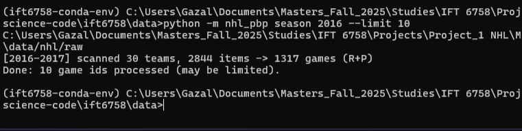
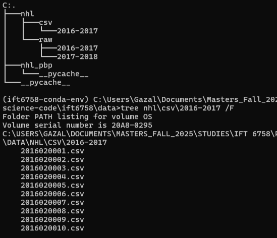
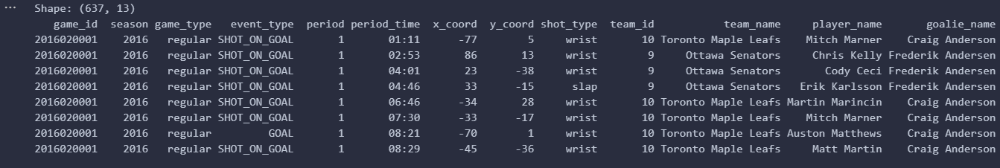
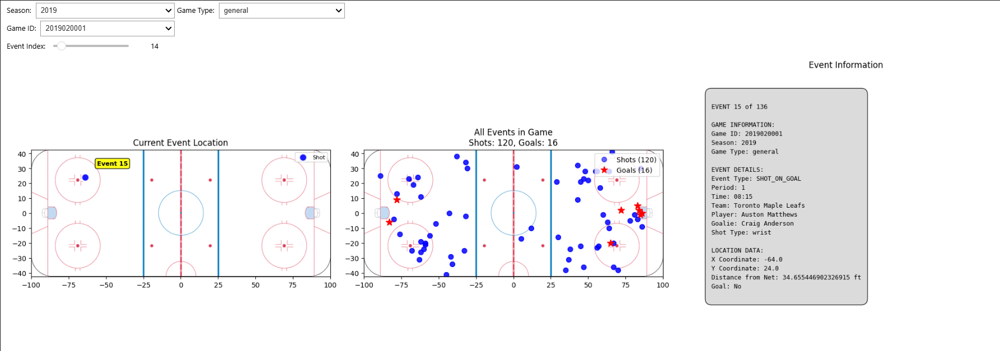
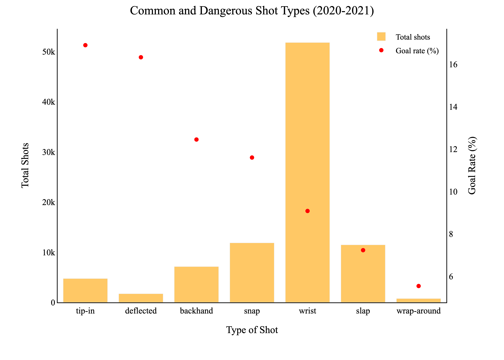
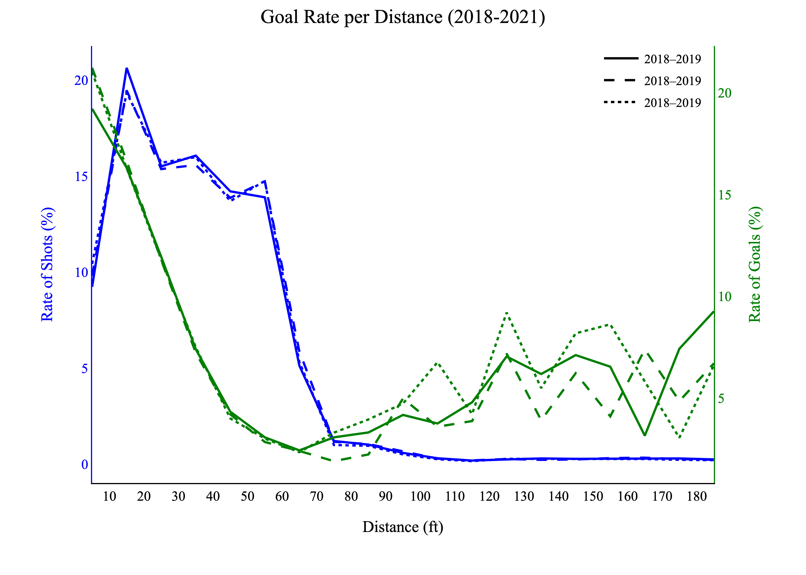
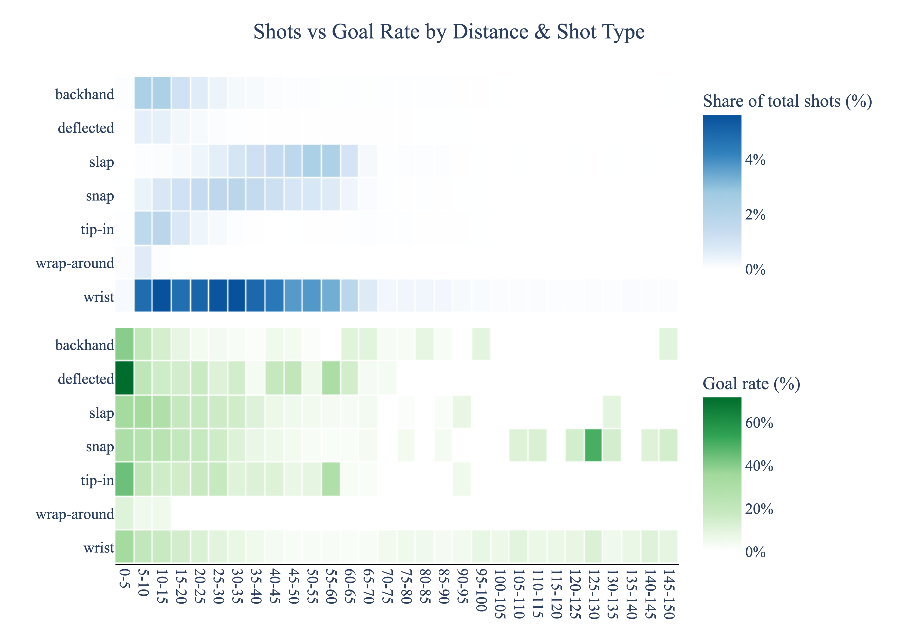
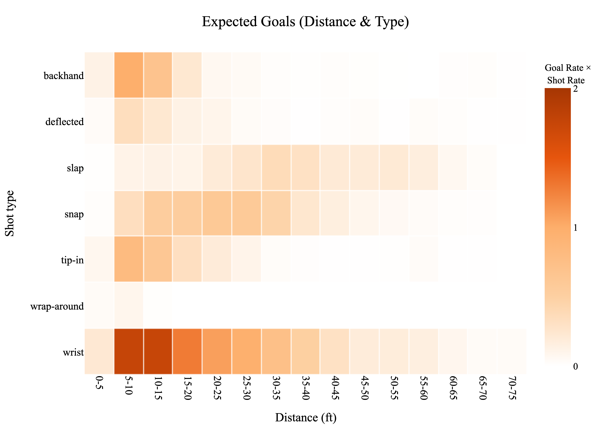

    COMMENT **Fill in this part and add an introduction to the blog. Let's try to tell a story**


# **Data Acquisition**
- A small Python package `nhl_pbp` that:
  1. **Discovers** game IDs per season across all teams,
  2. **Fetches** PBP JSON for each game (with retries & polite pauses),
  3. **Caches** raw JSON to disk (so reruns are fast),
  4. **Converts** cached JSON → per-game CSVs, with an optional **merged per-season** CSV,
  5. Exposes both a **Python class** (for notebooks) and a **CLI** (for batch runs).
- Everything is **reproducible**: stable folder layout, env-driven settings, and a manifest option.
## Question 1: How to download data
- **Write a brief tutorial on how your team downloaded the dataset.**
We use the NHL web API (base `https://api-web.nhle.com/v1`):

- **Season schedule / game discovery**  
  `/v1/club-schedule-season/{TEAM_TRICODE}/{SEASON}`  
  We loop all teams in the season, collect game IDs, and de-duplicate.

- **Play-by-play per game**  
  `/v1/gamecenter/{GAME_ID}/play-by-play`

Note: the old Stats API endpoint (`/api/v1/game/{game_id}/feed/live`) is unreliable/retired, so we use the newer web API above (confirmed with the TA).

- **Include your function/class, and provide an example of using it.** Please ensure you’re not just demonstrating that your functionality works - this is also an exercise in documenting and communicating your implementation. It does not need to be extremely complicated, but we expect something slightly more coherent and digestible than just screenshots of your functions/code.


#### 1.1 Install & configure
Environment & configuration
Optional env (defaults live in `config.py`):
| Var                 | Meaning                        | Example    |
| ------------------- | ------------------------------ | ---------- |
| `NHL_CACHE_DIR`     | Root folder for raw JSON cache | `nhl/raw` |
| `NHL_REQUEST_PAUSE` | Sleep between requests (sec)   | `0.25`     |
| `NHL_TIMEOUT_SEC`   | HTTP timeout (sec)             | `20`       |
| `NHL_MAX_RETRIES`   | Retries on 5xx/429             | `5`        |
| `NHL_PROGRESS`      | 1=show tqdm, 0=hide            | `1`        |

Dependencies:
```bash
pip install requests python-dotenv tqdm pandas pyarrow
```

1.2 Our class & function
```python
# nhl_pbp/downloader.py (orchestrator)
class NHLPBPDownloader:
    """
    Download & cache NHL play-by-play using the new NHL web API.

    Methods
    -------
    list_game_ids_for_season(season_start_year, include_regular=True, include_playoffs=True, progress=SHOW_PROGRESS) -> List[int]
    fetch_and_cache_pbp(game_id: int, force=False) -> Dict[str, Any]
    download_season(season_start_year, include_regular=True, include_playoffs=True, limit=None, progress=SHOW_PROGRESS) -> List[int]
    write_manifest(season_start_year, out_csv_path) -> int
    """
```
---
```python
# nhl_pbp/fetch.py (single-game fetch, cache-aware)
def fetch_and_cache_pbp(game_id: int, force: bool=False) -> Dict[str, Any]:
    """
    GET /v1/gamecenter/{game_id}/play-by-play.
    If cached and force=False -> read; else GET and cache.
    """
```
---
1.3 Python API — end-to-end example
```python

from nhl_pbp.downloader import NHLPBPDownloader
from nhl_pbp.fetch import fetch_and_cache_pbp
from nhl_pbp.transform import season_jsons_to_csvs_via_cache

dl = NHLPBPDownloader()

# 1) Discover game IDs (regular + playoffs)
game_ids = dl.list_game_ids_for_season(2016, include_regular=True, include_playoffs=True, progress=True)
print("Found", len(game_ids), "games:", game_ids[:5])

# 2) Fetch one game to cache (reuses cache on rerun)
pbp = fetch_and_cache_pbp(2017020001, force=False)

# 3) Cache a whole season (limit=None for full season)
ids = dl.download_season(2016, include_regular=True, include_playoffs=True, limit=None, progress=True)

# 4) Convert cached JSON -> CSVs (+ optional merged per-season CSV)
rows = season_jsons_to_csvs_via_cache(
    season_start_year=2016,
    out_dir="nhl/csv/2016-2017",
    merged_out_path="nhl/csv/2016-2017_events.csv"
)
print("Total rows written:", rows)
```
---
1.4 CLI — batch runs from the shell
```python
# list IDs (regular + playoffs if neither flag given)
python -m nhl_pbp ids 2016 --regular --playoffs

# one season (smoke test with limits)
python -m nhl_pbp season 2016 --limit 50

# multiple seasons (inclusive)
python -m nhl_pbp seasons --start 2016 --end 2023 --regular --playoffs

# full pipeline: download + convert + merged per-season CSVs
python -m nhl_pbp pipeline --start 2016 --end 2023 \
  --out-dir-base nhl/csv \
  --merged-base  nhl/csv
```
1.5 Schema we write (after transformation from json --> csv)
```json
["game_id","season","game_type","event_type","period","period_time",
 "x_coord","y_coord","shot_type","team_id","team_name","player_name","goalie_name"]
```
**Download sample (10 regular + 10 playoffs, 2016–17):**  


**Convert cached JSON → CSVs (per-game + merged):**  


**Processed CSVs (`nhl/csv/2016-2017/` + merged):**  


**Preview of merged CSV (`2016-2017_events.csv`):**  



# **Interactive Debugging Tool**
## Question 1
*Take a screenshot of the tool and add it to the blog post, accompanied with the code for the tool and a brief (1-2 sentences) description of what your tool does.*

---

**Overview**:
I built an interactive tool to help navigate and visualize NHL play-by-play data (See Figure 1). The interface includes dropdown menus to select seasons (2016-2023), game types (regular season or playoffs), and specific games. A slider lets users scroll through each event in the chosen game.

The display is divided into three sections:
- An ice rink diagram showing event locations
- A complete event list for the selected game
- Detailed information about the currently selected event



    COMMENT **ADD HTML pic**

- *Figure 2.2 - An overview of the interactive debugging tool showing event "14", a "wrist" shot taken by Toronto Mapple Leaf's Auston Mathews in the first period of the match against Senators that took place in 2019 (left). The image on the right shows the coordinate locations for all 136 events of that match (shots-on-goal and goals).* 


Key Features:
- Dropdown selectors for season, game type, and game ID
- Event navigation slider
- Rink visualization with color-coded events (blue for shots, red stars for goals)
- Real-time event details including coordinates, distance calculations, and player information

**Purpose**:
This tool serves as a debugging aid to verify data processing accuracy. It helps validate that coordinate mapping, distance calculations, and shot direction assignments are working correctly. The visual representation makes it easy to cross-reference with official NHL data.

    COMMENT **MAYBE REWRITE THIS (if we changed the method?)?**

**Current Limitation**:
A significant challenge in calculating precise shot distances is that the NHL data provides shot coordinates but not shooting direction. This creates ambiguity for shots taken near center ice or from defensive zones where it's unclear which net the player was targeting. To address this, I implemented a team-period approach that analyzes where most of a team's shots originate during a period to infer which net they're attacking. While this method works reasonably well in most cases, it remains an estimation rather than a perfect solution.


# **Tidy Data**
## Question 1
*In your blog post, include a small snippet of your final dataframe (e.g. using head(10)). You can just include a screenshot rather than fighting to get the tables neatly formatted in HTML/markdown* 

---

    COMMENT **MAYBE ADD A SCREENSHOT INSTEAD?**


*Figure 3.1*


game_id	season	game_type	event_type	period	x_coord	y_coord	shot_type	team_name	player_name	distance_from_net	is_goal
2016020001	2016	general	SHOT_ON_GOAL	1	-77	5	wrist	Toronto Maple Leafs	Player_8478483	13.0	0
2016020001	2016	general	SHOT_ON_GOAL	1	86	13	wrist	Ottawa Senators	Player_8467967	13.34	0
2016020001	2016	general	GOAL	1	-20	15	slap	Toronto Maple Leafs	Player_8471239	69.0	1

**Enhancing Strength Information**:
To add detailed strength situations (like 5v4, 5v3, etc.) for both shots and goals, we could:

- Monitor penalty events - Track when penalties begin and end to determine power play/penalty kill situations

- Analyze shift data - Count active players on ice for each team at any given moment

- Combine game context - Use penalty and faceoff information to reconstruct the exact player count scenario

This enhancement would require incorporating additional event types beyond just shots and goals, particularly penalties, faceoffs, and potentially player shift information if available.

## Question 2
*In a few sentences, discuss at least 3 additional features you could consider creating from the data available in this dataset. We’re not looking for any particular answers, but if you need some inspiration, could a shot or goal be classified as a rebound/shot off the rush (explain how you’d determine these!) ?*

---

1. **Rebound Detection**

Approach: Identify shots that occur shortly after previous shot attempts by the same team\
Method: Calculate time elapsed between consecutive shots (e.g., under 3 seconds) and flag rapid sequences as potential rebounds\
Benefit: Helps recognize high-danger scoring opportunities that develop from immediate follow-up attempts

2. **Rush Chance Identification**

Approach: Detect shots that happen quickly after entering the offensive zone\
Method: Flag shots occurring within a short timeframe (e.g., 5 seconds) of zone entry events\
Benefit: Distinguishes between transition opportunities and set offensive plays, providing insight into team speed and counter-attack effectiveness

3. **Shot Quality Assessment**

Approach: Create a composite metric that evaluates shot danger using multiple factors\
Method: Combine distance from net, shooting angle, shot type, and game situation to estimate scoring probability\
Benefit: Offers a more nuanced understanding of shot quality beyond basic location data, helping identify which shots are truly dangerous

# **Simple Visualizations**
## Question 1
*Produce a figure comparing the shot types over all teams. Aggregate all of the shots in a season of your choosing. Overlay the number of goals overtop the number of shots. What appears to be the most dangerous type of shot? The most common type of shot? Why did you choose this figure?*

---

For this exercice, we choose the season with most recorded events, the 2021-2022 season. The objective is to vizualize in a single figure the relationship between the number of shots, their type (wrist, snap, slap, backhand, tip-in, deflected, wrap-around). Contrary to the instructions, we chose to visualize the success rate of shots (e.g. the rate of goals per shots) instead of the number of goals, since the significant difference between "wrist" and the other categories would  obscure the reading of the figure.




- *Figure 5.1 presents the distribution of different shot types in the 2021–2022 season. The total number of shots per type (bars) is compared to the goal rate for each type (%, markers). We observe that the 'Wrist' shot is by far the most common, while the 'Tip-in' has the highest scoring rate.*


The figure was chosen to convey with a glance the total number of shots and identify the most common type. The bars have been sorted by decreasing goal rate values, to also make easier to identify the most "successful" type of shots. "Tip-in" and "deflected" appear as the most efficient shots, though uncommon. For further discussion on the most "dangerous" type see figures 5.3a and 5.3b.


## Question 2
*What is the relationship between the distance a shot was taken and the chance it was a goal? Produce a figure for each season between 2018-19 to 2020-21 to answer this. Has there been much change over the past three seasons? Why did you choose this figure?*

---

For this exercice, distances are grouped into 10-ft bins (e.g., 0–10, 10–20) and were computed as the Euclidean distance between each shot’s (x,y) location and each team's net for each period. We chose to present a single figure for all three seasons to compare changes in trends over time.




- *Figure 5.2 compares the volume of shots by distance from the net (shot/total shots) (left) with the ratio of goals by distance (goals/shot) (right).*


Across seasons, the distributions of shots and goals are stable, except for the very rare defensive-zone attempts (shots taken from beyond ~90 ft). These vary by season and show higher goal rates than the neutral zone. We interpret those shots as "empty-net". In all seasons, goal probability rises as shots are taken closer to the net, though attempts within ~6 ft are rare. The most effective zone is approximately 6–18 ft, where both shot volume and goal rate are high.


## Question 3
*Combine the information from the previous sections to produce a figure that shows the goal percentage (# goals / # shots) as a function of both distance from the net, and the category of shot types (you can pick a single season of your choice). Briefly discuss your findings; e.g. what might be the most dangerous types of shots?*

---
For consistency, we continue working with the 2021-2022 season (see Figure 5.1). 





- *Figure 5.3a shows the goal rate (goals / shots) for each shot type at each distance (bottom), alongside the share of shots, i.e. shots / total shots (top).*

 The most  "dangerous” shots are close-range "deflect", followed by close-range "tip-in" and long-range "snap" shots. However, these shots are extremely rare (each <0.03% of all shots), so their practical impact is limited. To give a more realistic picture, Figure 5.3b adds a view of dangerous shots and expected goals taking in consideration their total volume, highlighting type–distance combinations that are both sufficiently common and have strong scoring rates.




- *Figure 5.3b presents the most "expected" shot types by distance, to make very effective and uncommon shots less visible*

An alternative figure is proposed for this exercice to account for shot types that have a very high goal rate in certain zones, yet are very uncommon, such as "Deflected" within 0-5 feet. In Figure 5.3a, these shots/zones are most visible, yet in reality they happen at very rare ocassions. For Figure 5.3b, we understand as "dangerous", shots that are both effective and common and thus are the most "expected" for goals. Darker zones indicate higher danger, combining both a larger number of shots from that zone and a higher goal rate for the specific type. The z-metric was calculated as: z = goal_rate × (shot_share)^α, where 0 < α < 1. The exponent α was introduced to account for the unbalanced distribution of shot types (See Figure 5.1).


We observe that the most expected goals come "Wrist" shots taken from within 5–25 ft. "Tip-in", "Snap", and "Backhand" are also dangerous, though from different distance zones for each type.  At longer distances, "Slap", "Snap" and "Wrist" shots are the only that seem effective. "Empty-net" goals taken from a distance over 90ft are not expected due to their very few number. The least common and expected goal type is the "Wrap-around".

# **Advanced Vizualisations: Shot Maps**
## Question 1
- **Export the 4 plot offensive zone plots to HTML, and embed it into your blog post.**
- Your plot must allow users to **select any team during the selected season**.
- Note: Because you can find these figures on the internet, answering these questions without producing these figures will not get you any marks!

## Question 2
- **Discuss** (in a few sentences) what you can interpret from these plots.

## Question 3
- Consider the **Colorado Avalanche**; take a look at their **shot map** during the 2016-17 season. **Discuss** what you could say about the team during this season.
- Now look at the shot map for the Colorado Avalanche for the 2020-21 season, and **discuss** what you could conclude from these differences. Does this make sense? Hint: look at the standings.

## Question 4
- Consider the Buffalo Sabres, which have been a team that has struggled over recent years, and **compare** them to the Tampa Bay Lightning, a team which has won the Stanley for two years in a row.
- Look at the shot maps for these two teams from the 2018-19, 2019-20, and 2020-21 seasons. **Discuss** what observations you can make.
- Is there anything that could explain the Lightning’s success, or the Sabres’ struggles? How complete of a picture do you think this paints?


