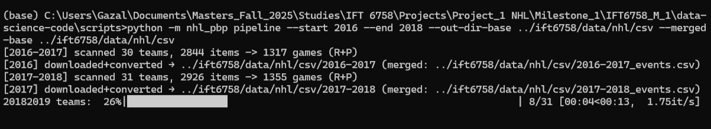
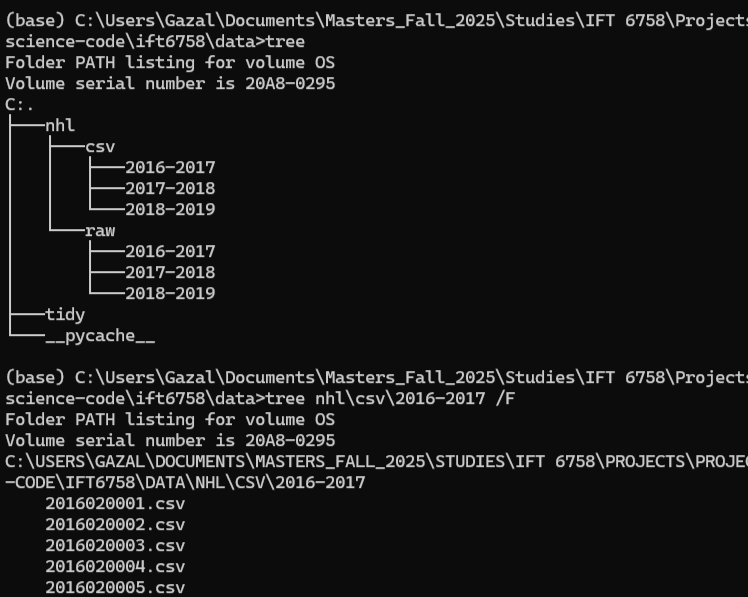

## Introduction: What makes an NHL shot truly dangerous, and can we prove it with data?

To answer this question, we took the following steps:

- Step 1 explains how `nhl_pbp` works, a tiny Python package that **pulls NHL play-by-play**, **caches raw JSON**, and **emits** per-game and per-season **CSVs** so every run is reproducible.
- Step 2 presents a lightweight **interactive debugging tool**, including a rink plot and a details panel, to visualize the coordinates of events for a certain match.
- Step 3 was never defined but we kept the naming of the original instructions to avoid confusion.
- Step 4 shows the final format of our **clean** dataset (Figure 4.1).
- Step 5 presents the relationship between **shot types** and **goals** (Figure 5.1), the rate of goals and number of shots by **distance** from the net (Figure 5.2), as well as an overview of the most **expected** goals and most **dangerous** shots (Figures 5.3a and 5.3b). The resulting picture shows that wrist shots are the most common, close-range "deflect" and "tip-in" shots have the highest goal rate, and the 6–18 ft band from the net is the danger zone.
- Step 6 presents heatmap figures for each team in each season, indicated where the team is over-shooting and where it's under-shooting. These can be used to improve attack and defense strategies for future matches.


---


# **Step 1: Data Acquisition**
This part explains how to create a small Python package `nhl_pbp` that:
  1. **Discovers** game IDs per season across all teams,
  2. **Fetches** PBP JSON for each game (with retries & polite pauses),
  3. **Caches** raw JSON to disk (so reruns are fast),
  4. **Converts** cached JSON → per-game CSVs, with an optional **merged per-season** CSV,
  5. Exposes both a **Python class** (for notebooks) and a **CLI** (for batch runs).

The package includes a stable folder layout, env-driven settings, and a manifest option to assure that everything is **reproducible**.

## Question 1: How to download data

To download the dataset we use the NHL web API (base `https://api-web.nhle.com/v1`). Using the extension `/v1/club-schedule-season/{TEAM_TRICODE}/{SEASON}`, we loop all teams in the season, collect game IDs, and de-duplicate. We use the newer web API instead of the old Stats API endpoint (`/api/v1/game/{game_id}/feed/live`).

### Step by Step Guide
#### 1.1 Install & configure
Environment & configuration
Optional env (defaults live in `config.py`):
```bash
| Var                 | Meaning                        | Example    |
| ------------------- | ------------------------------ | ---------- |
| `NHL_CACHE_DIR`     | Root folder for raw JSON cache | `ift6758/data/nhl/raw` |
| `NHL_REQUEST_PAUSE` | Sleep between requests (sec)   | `0.25`     |
| `NHL_TIMEOUT_SEC`   | HTTP timeout (sec)             | `20`       |
| `NHL_MAX_RETRIES`   | Retries on 5xx/429             | `5`        |
| `NHL_PROGRESS`      | 1=show tqdm, 0=hide            | `1`        |
```
Dependencies:
```bash
pip install requests python-dotenv tqdm pandas pyarrow
```

#### 1.2 Our class & function
```python
# nhl_pbp/downloader.py (orchestrator)
class NHLPBPDownloader:
    """
    Download & cache NHL play-by-play using the new NHL web API.

    Methods
    -------
    list_game_ids_for_season(season_start_year, include_regular=True, include_playoffs=True, progress=SHOW_PROGRESS) -> List[int]
    fetch_and_cache_pbp(game_id: int, force=False) -> Dict[str, Any]
    download_season(season_start_year, include_regular=True, include_playoffs=True, limit=None, progress=SHOW_PROGRESS) -> List[int]
    write_manifest(season_start_year, out_csv_path) -> int
    """
```
---
```python
# nhl_pbp/fetch.py (single-game fetch, cache-aware)
def fetch_and_cache_pbp(game_id: int, force: bool=False) -> Dict[str, Any]:
    """
    GET /v1/gamecenter/{game_id}/play-by-play.
    If cached and force=False -> read; else GET and cache.
    """
```
---
```python
# nhl_pbp/discovery.py
def _extract_game_type(item: Dict[str, Any]) -> str:
    """
    Return one of {'PR','R','P','A','UNK'} from a schedule item.
    New API isn't fully consistent, so we try multiple fields.
    """
```
---
```python
# nhl_pbp/transform.py
def json_to_csv(json_path: str, out_csv_path: str) -> int:
    """
    Convert one game JSON to a CSV matching EVENT_COLUMNS.
    Returns number of rows written.
    """
```
---
```python
# nhl_pbp/transform.py 
def season_jsons_to_csvs_via_cache(
    season_start_year: int,
    out_dir: str,
    merged_out_path: Optional[str] = None,
) -> int:
    """
    Iterate cached game JSONs for a season (using cache.iter_cached_games),
    write per-game CSVs to out_dir, and optionally a merged CSV.
    Returns total rows written (sum across games).
```
---
#### 1.3 Run the pipeline two ways (CLI or Notebook)
**Option A — CLI (multi-season, one shot)**

***Note: Run from data-science-code/scripts/ so the ../ift6758/... paths resolve.***
```python
# list IDs (regular + playoffs if neither flag given)
python -m nhl_pbp ids 2016 --regular --playoffs

# one season (smoke test with limits)
python -m nhl_pbp season 2016 --limit 50

# multiple seasons (inclusive)
python -m nhl_pbp seasons --start 2016 --end 2023 --regular --playoffs

# full pipeline: download + convert + merged per-season CSVs
python -m nhl_pbp pipeline --start 2016 --end 2018 \
  --out-dir-base ../ift6758/data/nhl/csv \
  --merged-base ../ift6758/data/nhl/csv
```

**Option B — Notebook nhl_pbp__from_api_to_csv_2016_2023 (loop over seasons)**
```python
from pathlib import Path
from nhl_pbp.downloader import NHLPBPDownloader
from nhl_pbp.transform import season_jsons_to_csvs_via_cache

def season_label(y: int) -> str:
    return f"{y}-{y+1}"

BASE = Path("../ift6758/data/nhl/csv")
dl = NHLPBPDownloader()

total_rows_all = 0
for season in range(2016, 2024):  # 2024 is exclusive → runs 2016..2023
    label = season_label(season)
    out_dir = BASE / label
    merged_path = BASE / f"{label}_events.csv"

    print(f"\n=== {label} ===")
    # 1) Download & cache the whole season (regular + playoffs)
    ids = dl.download_season(
        season_start_year=season,
        include_regular=True,
        include_playoffs=True,
        limit=None,
        progress=True
    )
    print(f"Cached {len(ids)} games.")

    # 2) Transform cached JSON → per-game CSVs + merged per-season CSV
    rows = season_jsons_to_csvs_via_cache(
        season_start_year=season,
        out_dir=str(out_dir),
        merged_out_path=str(merged_path)
    )
    total_rows_all += rows
    print(f"Wrote {rows} rows → {merged_path}")

print(f"\nDone. Total rows across seasons: {total_rows_all}")
```
---
#### 1.4 Schema we write (after transformation from json --> csv)
```json
["game_id","season","game_type","event_type","period","period_time",
 "x_coord","y_coord","shot_type","team_id","team_name","player_name","goalie_name"]
```
---
#### 1.5 CLI and Notebook results

*Figure 1.1 Download NHL PBP — Fetch→Transform→CSV (2016–2023):*

<!--  -->


*CLI pipeline run showing teams scanned, items → games `(R+P)`, and the path to the merged per-season CSV produced for each year.*

*Figure 1.2 Processed CSVs (`nhl/csv/2016-2017/` + merged)*

<!--  -->


*Folder layout: per-game CSVs live under `nhl/csv/2016-2017/`, plus a season-level file `2016-2017_events.csv` for quick analysis.*

*Figure 1.3 Preview of merged CSV (`2016-2017_events.csv`)*

<!--  -->


*A peek at the consolidated season file (columns like `game_id`, `season`, `event_type`, `x_coord`, `y_coord`, etc.). The script prints the row count after each write.*

*Figure 1.4 Running via notebook (one-shot process to get `2016–2023` data JSONs → CSVs):*

<!--  -->


*(Notebook loop over seasons with `tqdm` progress per team; for each season it caches games, writes per-game CSVs, and emits a merged `<season>_events.csv`, then prints the total rows.)*


---
# **Step 2: Interactive Debugging Tool**
## Question 2: Our Interactive Debugging Tool

We built an interactive tool using ipywidgets to explore NHL play-by-play data visually. This tool helps us verify the quality of the retreived data and visualize certain event, such as "shots-on-goals" and "goals".

**What We Built:**
  - Our interface loads processed game data from our processed datasets.
  - Maps raw coordinate data to standardized ice rink positions.
  - Provides real-time event filtering and display.
  - Handles coordinate transformations for consistent visualization.

**Interactive Features**:
- Dropdown menus that allow us to select and visualize the different available seasons and game types (regular, play-offs).
- A slider to browse through individual events within selected games.
- A three-panel display that shows:\
-The selected event plotted on an ice rink.\
-All events for the current game.\
-Available metadata for the selected event.

**Other Features:**
- Color-coded events: blue circles for shots, red stars for goals.
- Real-time coordinate display.
- Support for browsing across multiple seasons and game types.

<!-- -->


- *Figure 2.1 - An overview of the interactive debugging tool showing event "14", a "wrist" shot taken by Toronto Mapple Leaf's Auston Mathews in the first period of the match against Senators that took place in 2019 (left). The image on the right shows the coordinate locations for all 136 events of that match (shots-on-goal and goals).*

**A Challenge We Faced**\
The NHL data gives us the (x, y) coordinates of a shot, but it does not indicate which net the player was shooting at. To solve this, we implemented a team-period approach. We looked at where most of a team's shots come from in a single period (negative or positive x coordinates) and assumed that the net they are attacking is located in that zone. We then created a column 'net' with values 'left' or 'right' (see notebook *Step_5_simple_vis.ipynb*). After consulting with the teaching team, we were informed that the raw JSON data is structured so that the home team starts the game by always defending the net located in the negative coordinate zone. This allows to deduce the correct net by alternating the net positions between each period. Following that logic, we changed our code creatning the tidy CSV files (see *4- tidy_data_creator.py*). However, we did not recreate the figures, as we expect no observable differences compared to our original approach. Our current code thus includes both methods. We consider our first deductive approach to be a useful fallback in case we need to work with data having a less clear structure.


---
# **Step 4: Tidy Data**
## Question 4.1 : Dataframe Example and Strength Analysis

Our data processing pipeline transforms raw NHL API JSON data into structured pandas DataFrames. Here's a sample of our clean data structure:

<!--  -->



- *Figure 4.1 - screenshot of a sample of our CSV columns after transforming the raw JSON files. The figure is presented in two rows for better visualization.*

**Data Processing Pipeline**\
1-Raw Data Ingestion: Load JSON files from NHL API endpoints.\
2-Event Extraction: Filter for relevant events (shots and goals).\
3-Player Name Mapping: Replace player IDs with real names using roster data.\
4-Coordinate Processing: Handle missing values and standardize coordinate systems.\
5-Feature Engineering: Calculate distances, angles, and game context features.

**Strength Information Challenge**\
Currently, strength information (even strength, power play, shorthanded) is only available for goals, not shots. To add detailed strength situations (5-on-4, 5-on-3, etc.), we would need to:

1-Process Penalty Events: Track penalty calls and durations to determine manpower situations.\
2-Reconstruct Game State: Combine penalty data with other events to determine active player counts.\
3-Estimate a Time Correlation: Match shot events with active penalty periods to deduce the strength contex of shots.

## Question 4.2 : Potential Additional Features

Based on our analysis of the available data, here are three extra features we could create:

1. **Rebound Detection:** Identify shot sequences where the same team takes another shot within 2-3 seconds of a previous shot or save. This would allow us to examine timestamp sequencing and event type correlation and understand how sustained offensive pressure leads to improved scoring chances.

2. **Rush Chance Identification:** Flag shots that occur within 4-5 seconds of zone entries or turnovers. This would allow us to measures a team's effectiveness in offense transition and counter-attacks.

3. **Scoring Chance Quality :** Use the location, type, distance, and angle of each shot as input features to calculate a “danger score” in a predictive model. This would allow us to estimate the probability of a shot resulting in a goal and identify which specific features have the greatest impact on increasing those chances.

<!-- -->



- *Figure 4.2 was generated using our NHLDataWrangler class and shows the top ten scorers across (left) and the teams with most goals (right) across all seasons.*

**Left Panel: Top 10 Goal Scorers (2016-2023)**\
  Displays the most prolific goal scorers across all seasons. The graph uses player ID mapping from our processed dataset and shows total goal counts for each player.

**Right Panel: Top 10 Teams by Goals (2016-2023)**\
  Ranks teams by total goals scored over the 7-season period. The graphe uses team ID mapping to display proper team abbreviations and provides comparative analysis of team offensive performance

The visualization is based on data processed by our NHLDataWrangler class, which processes raw NHL API JSON data from 2016-2023 seasons, extracts shot and goal events from game files, maps player and team IDs to readable names and calculates aggregate statistics for analysis.

---

# **Step 5: Simple Visualizations**
## Question 5.1: Shot Types (Season 2020-2021)

For this exercice, we chose the season with most recorded events, the 2021-2022 season, to include more observations in the figures. The objective of the first task is to vizualize with a single figure the relationship between the number of shots, their type (wrist, snap, slap, backhand, tip-in, deflected, wrap-around) and effectiveness (goals or not). Contrary to the instructions, we chose to visualize the success rate of shots (e.g. the rate of goals per shots) instead of the number of goals, since testing showed that the significant difference between "wrist" and the other categories obscures the reading of the figure.

<!-- -->


- *Figure 5.1 - Distribution of different shot types in the 2021–2022 season. The total number of shots per type (bars) is compared to the goal rate for each type (%, markers). We observe that 'wrist' shots are by far the most common, while the 'tip-in' shots have the highest scoring rate.*


The figure was chosen to identify with a single glance the total number of shots, the most common type and the highest scoring rate. The bars have been sorted by decreasing goal rate values, to also make easier to identify the most "successful" type of shots. "Tip-in" and "deflected" appear as the most efficient shots, though less common than "wrist", "snap" or "slap". For further discussion on the most "dangerous" type see figures 5.3a and 5.3b.


## Question 5.2: Distances, Shots and Goals

For this exercice, distances are grouped into 10-ft bins (e.g., 0–10, 10–20) and computed as the Euclidean distance between each shot’s (x,y) location and each team's net for each period. We present a single figure for all three seasons to compare changes in trends over time.

<!-- -->


- *Figure 5.2 compares the rate of shots by distance from the net (shots_per_type / total shots) (left) with the rate of goals by distance (goals_per_type / shots_per_type) (right).*


Across seasons, the distributions of shots and goals are stable, except for the very rare defensive-zone attempts (shots taken from beyond ~90 ft). These vary by season and show higher goal rates than the middle neutral zone. We interpret those shots as "empty-net", shots taken when goalie was out of position. In all seasons, goal probability rises as shots are taken closer to the net, though attempts within ~6 ft are rare. The most effective zone is approximately 6–18 ft, where both shot volume and goal rate are high.


## Question 5.3: Dangerous Shots and Expected Goals

For consistency, we continue working with the 2021-2022 season (like in Figure 5.1).


<!-- -->


- *Figure 5.3a shows the goal rate (goals / shots) for each shot type at each bin of distances (bottom), alongside the share of shots, i.e. shots / total shots (top).*

 The most  "dangerous” shots are close-range "deflect", followed by close-range "tip-in" and long-range "snap" shots. However, these shots are extremely rare (each <0.03% of all shots), so their practical impact is limited. To give a more realistic picture, Figure 5.3b proposes a view of dangerous shots and expected goals taking in consideration their total volume, highlighting type–distance combinations that are both sufficiently common and have strong scoring rates.

<!-- -->


- *Figure 5.3b - Most "expected" shot types by distance, to account for very effective and uncommon shots that here are less visible*

An alternative figure is proposed for this exercice to account for shot types that have a very high goal rate in certain zones, yet are very uncommon, such as "deflected" within 0-5 feet. In Figure 5.3a, these shots/zones are most visible, yet in reality they happen at very rare ocassions. For Figure 5.3b, we understand as "dangerous", shots that are both effective and common and thus are the most "expected" goals. Darker zones indicate higher danger, combining both a larger number of shots from that zone and a higher goal rate for the specific type. The z-metric was calculated as: z = goal_rate × (shot_share)^α, where a=0.8 . The exponent α was introduced to account for the unbalanced distribution of shot types (See Figure 5.1).


We observe that the most expected goals come "wrist" shots taken from within 5–25 ft. "Tip-in", "snap", and "backhand" are also dangerous, though from different distance zones for each type.  At longer distances, "slap", "snap" and "wrist" shots are the only ones that appear to be effective. "Empty-net" goals taken from a distance over 90ft are not expected due to their very few number. The least common and expected goal type is the "wrap-around".

---

# **Step 6: Advanced Vizualisations: Shot Maps**
In this part, we created heatmaps from our data for each team to indicate where they are over-shooting and where they are under-shooting in regions of the rink.



## Question 6.1: Importing Plots


- *Figure 6.1 - Embedded interactive tool that allows to explore a team’s excess shot rates over a season.*

## Question 6.2: Plot Interpretations

Figure 6.1 shows a heatmap of a team’s excess shot rates for a given season, overlaid on the offensive side of an NHL rink. This allows us to see where the team is over-shooting or under-shooting relative to the league average for that season. The visualization also provides insights into the team’s offensive strategy. In the hands of an actual NHL team, the plots could indicate areas where the defense should focus to limit high-danger chances against a certain opponent.

## Question 6.3: Colorado Avalanche

During the 2016-2017 season, the Colorado Avalanche tended to take fewer shots from the high-danger area in front of the net compared to the league average and more shots from the flanks. This suggests that their offense relied more on perimeter shooting rather than taking chances from close range. This might indicate a need to improve net-front presence to increase scoring opportunities.

During the 2020-2021 season, Colorado Avalanche seem to have changed their offensive style. They seem to be taking a lot of shot opportunities in front of the net and also in other areas. We conclude that they have adapted a more aggressive playstyle, which explains their strong performance in the standings in this season compared to the 2016-2017 season.


## Question 6.4: Buffalo Sabers and Tempa Bay Lightning

The Buffalo Sabres show weak offensive activity across all three seasons (2018–19, 2019–20, 2020–21). In 2018–19, they already under-shoot the high-danger area in front of the net and rely more on low-percentage perimeter shots from the flanks, particularly the right side. In the following seasons, their shot maps show even larger blue regions, meaning they are generating fewer shots than the league average overall. This lack of offensive pressure, especially from dangerous scoring areas, helps explain their ongoing struggles and poor results in the standings.

The Tampa Bay Lightning, in contrast, display a consistent offensive effort. Their heatmaps show high shot generation from the slot and mid-range areas (10–20 feet from the net), which are high-probability scoring locations. Even if they don't always shoot a lot directly in front of the net, they still create pressure in dangerous zones. This suggests strong offensive systems, and players who can generate quality chances.

The Lightning’s success can reasonably be linked to their high shot volume in dangerous areas, consistent offensive strategy, and ability to sustain pressure in the offensive zone, while the Sabres’ struggles stem from low overall shooting volume, weak presence in high-danger areas, and reliance on low-quality perimeter shots.

However, shot maps only provide part of the story. They reflect offensive tendencies but don't account other factors like defensive performance, expected goals, or differences in coaching systems and roster depth.

---

# Sources / references

- Community **NHL Web API** reference (endpoints & examples). ([GitHub](https://github.com/Zmalski/NHL-API-Reference))
- Threads pointing to **club-schedule-season** for season-wide game discovery. ([Reddit](https://www.reddit.com/r/hockey/comments/17skeu2/created_some_reference_documentation_for_the_new/))
- **Play-by-play** via `gamecenter/{GAME_ID}/play-by-play`. ([Medium](https://medium.com/%40vtashlikovich/nhl-api-what-data-is-exposed-and-how-to-analyse-it-with-python-745fcd6838c2))
- Legacy StatsAPI doc (for understanding the **10-digit game ID** format). ([about.gitlab.com](https://gitlab.com/dword4/nhlapi/-/blob/master/stats-api.md))
