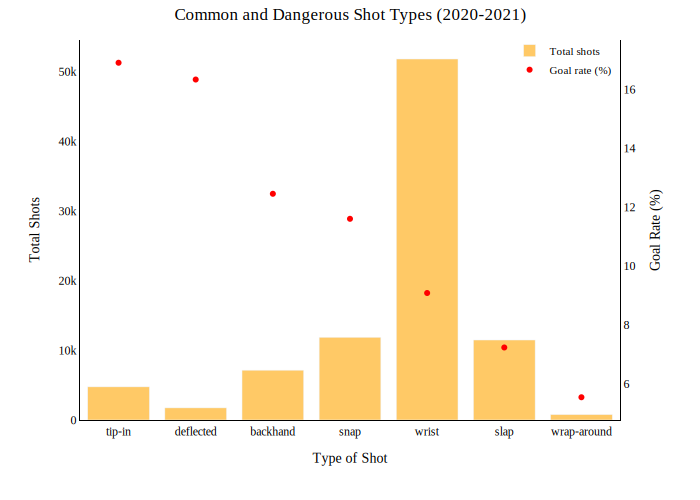
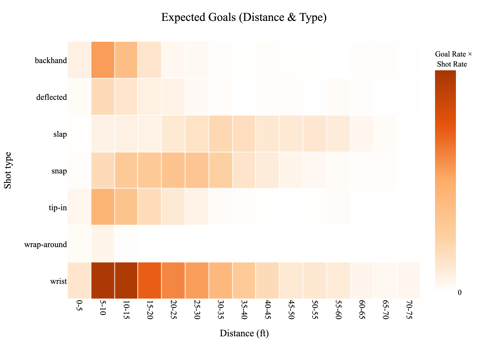

# **Data Acquisition**
Short description here
## Question 1: How to download data
- **Write a brief tutorial on how your team downloaded the dataset.**
- Imagine that you were searching for a guide on how to download the play-by-play data; your guide should make you go “Perfect - this is exactly what I was looking for!”.
- **Include your function/class, and provide an example of using it.** Please ensure you’re not just demonstrating that your functionality works - this is also an exercise in documenting and communicating your implementation. It does not need to be extremely complicated, but we expect something slightly more coherent and digestible than just screenshots of your functions/code.

# **Interactive Debugging Tool**
## Question 1
- Implement an ipywidget (or interactive tool of your choosing) that allows you to flip through all of the events, for every game of a given season, with the ability to switch between the regular season and playoffs.
- Draw the event coordinates on the provided ice rink image, similar to the example shown below (you can just print the event data when there are no coordinates). You may also print whatever information you find useful, such as game metadata/boxscores, and event summaries (but this is not required).
- **Take a screenshot of the tool and add it to the blog post, accompanied with the code for the tool and a brief (1-2 sentences) description of what your tool does.** You do not need to worry about embedding the tool into the blogpost.

# **Tidy Data**
## Question 1
- In your blog post, include **a small snippet of your final dataframe** (e.g. using head(10)). You can just include a screenshot rather than fighting to get the tables neatly formatted in HTML/markdown

## Question 2
- In a few sentences, **discuss at least 3 additional features you could consider creating from the data available in this dataset.** We’re not looking for any particular answers, but if you need some inspiration, could a shot or goal be classified as a rebound/shot off the rush (explain how you’d determine these!) ?

# **Simple Visualizations**
## Question 1
*Produce a figure comparing the shot types over all teams. Aggregate all of the shots in a season of your choosing. Overlay the number of goals overtop the number of shots. What appears to be the most dangerous type of shot? The most common type of shot? Why did you choose this figure?*

For this exercice, we choose the season with most recorded events, i.e. 2021-2022. The objective is to vizualize in a single figure the relationship between the number of shots, their type (wrist, snap, slap, backhand, tip-in, deflected, wrap-around). Contrary to the instructions, we chose to visualize the success rate of shots (e.g. the rate of goals per shots) instead of the number of goals, since the significant difference between "wrist" and the other categories would  obscure the reading of the figure.

Figure 5.1 compares the different shot types during the 2021–2022 season. The bars represent the total number of shots per type. Markers indicate the goal rate for each type (%). We observe that the 'wrist' shot is by far the most common, while the 'tip-in' has the highest scoring rate.

The figure was chosen to convey with just a glance the total number of shots and identify the most common type (wrist). The bars have been sorted by decreasing goal rate values, to also make easier to identify the most "successful" type of shots. However, from this information alone, it is hard to deduce the most "dangerous" type. See instead figure 5.3.

## Question 2
*What is the relationship between the distance a shot was taken and the chance it was a goal? Produce a figure for each season between 2018-19 to 2020-21 to answer this. Has there been much change over the past three seasons? Why did you choose this figure?*

Figure 5.2 compares the rate of shots by distance from the net (left) with the share of goals by distance (right). Distances are grouped into 10-ft bins (e.g. 0–10 and 10–20). We observe a stable pattern for shots and goal distribution across seasons expept for the very rare shots taken from the defensive zone of each team. These unpredictable shots vary signficantly for each season and also result in higher goal rates compared to the neutral zone. We assume they correspond to "empty net" shots, i.e. those taken when the golie was absent. For all seasons, goal probabilities are higher for shots xtaken closer to the net, though shots within a 6 ft distance are rare. The most effective zone is 6–18 ft, where both shot volume and goal rate are high.

## Question 3
*Combine the information from the previous sections to produce a figure that shows the goal percentage (# goals / # shots) as a function of both distance from the net, and the category of shot types (you can pick a single season of your choice). Briefly discuss your findings; e.g. what might be the most dangerous types of shots?*



Figure 5.3 presents the most "dangerous" shot types by distance. Darker zones indicate higher danger, combining both a larger number of shots from that zone and a higher goal rate for the specific type. The z-metric was calculated as: z = goal_rate × (shot_share)^α, where 0 < α < 1. The exponent α was introduced to account for the unbalanced distribution of shot types (Figure 5.1 shows that the number of "Wrist" shots is multiple times higher than the rest).  We observe that the most dangerous shots are "Wrist" shots taken from within 5–25 ft. "Tip-in", "Snap", and "Backhand" are also dangerous, though from different distance zones for each type.  At longer distances, "Slap", "Snap" and "Wrist" shots are the only that seem effective. In this calculation method, the very rare long-distance goal are shown as statistically not dangerous due to their very few number. The least common and effective shot type is the "Wrap-around".

# **Advanced Vizualisations: Shot Maps**
## Question 1
- **Export the 4 plot offensive zone plots to HTML, and embed it into your blog post.**
- Your plot must allow users to **select any team during the selected season**.
- Note: Because you can find these figures on the internet, answering these questions without producing these figures will not get you any marks!

## Question 2
- **Discuss** (in a few sentences) what you can interpret from these plots.

## Question 3
- Consider the **Colorado Avalanche**; take a look at their **shot map** during the 2016-17 season. **Discuss** what you could say about the team during this season.
- Now look at the shot map for the Colorado Avalanche for the 2020-21 season, and **discuss** what you could conclude from these differences. Does this make sense? Hint: look at the standings.

## Question 4
- Consider the Buffalo Sabres, which have been a team that has struggled over recent years, and **compare** them to the Tampa Bay Lightning, a team which has won the Stanley for two years in a row.
- Look at the shot maps for these two teams from the 2018-19, 2019-20, and 2020-21 seasons. **Discuss** what observations you can make.
- Is there anything that could explain the Lightning’s success, or the Sabres’ struggles? How complete of a picture do you think this paints?

