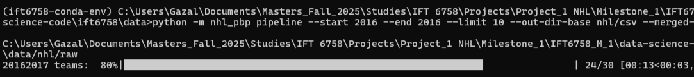

> *We started with a simple question: what makes an NHL shot truly dangerous—and can we prove it with data?*

To answer this this question, first, we need data. 

Step 1, below, explains how `nhl_pbp` works, a tiny Python package that **pulls NHL play-by-play**, **caches raw JSON**, and **emits tidy per-game and per-season CSVs** so every run is reproducible.\
Step 2, presents a lightweight interactive debugging tool—**rink plot**, **event scrubber**, and **details pane**—to sanity-check distances and which net a team was attacking.\
Step 4 shows the final format of our clean dataset (Step3 was never defined but we kept the naming of the original instructions to avoid confusion).\
Step 5 presents the relationship between **shot types** and **goals** (Figure 5.1), the rate of goals and number of shots by **distance** from the net (Figure 5.2), as well as an overview of the most **expected** goals and most **dangerous** shots (Figures 5.3a and 5.3b). The resulting picture shows that **wrist shots dominate volume**, **close-range "deflect" and "tip-in" shots** have the highest goal rate, and the **6–18 ft band** is the **danger zone**.\
Lastly, Step 6 calculates the excess shot rates for a given season (Figure 6.1) which can be used to improve attack and defense strategies for future matches.

---


# **Step 1: Data Acquisition**
This part explains how to create a small Python package `nhl_pbp` that:
  1. **Discovers** game IDs per season across all teams,
  2. **Fetches** PBP JSON for each game (with retries & polite pauses),
  3. **Caches** raw JSON to disk (so reruns are fast),
  4. **Converts** cached JSON → per-game CSVs, with an optional **merged per-season** CSV,
  5. Exposes both a **Python class** (for notebooks) and a **CLI** (for batch runs).

Everything is **reproducible**: stable folder layout, env-driven settings, and a manifest option.

## Question 1: How to download data

To download the dataset we use the NHL web API (base `https://api-web.nhle.com/v1`). Using the extension `/v1/club-schedule-season/{TEAM_TRICODE}/{SEASON}`, we loop all teams in the season, collect game IDs, and de-duplicate. We use the newer web API instead of the old Stats API endpoint (`/api/v1/game/{game_id}/feed/live`).

### Step by Step Guide
#### 1.1 Install & configure
Environment & configuration
Optional env (defaults live in `config.py`):
```bash  
| Var                 | Meaning                        | Example    |
| ------------------- | ------------------------------ | ---------- |
| `NHL_CACHE_DIR`     | Root folder for raw JSON cache | `nhl/raw` |
| `NHL_REQUEST_PAUSE` | Sleep between requests (sec)   | `0.25`     |
| `NHL_TIMEOUT_SEC`   | HTTP timeout (sec)             | `20`       |
| `NHL_MAX_RETRIES`   | Retries on 5xx/429             | `5`        |
| `NHL_PROGRESS`      | 1=show tqdm, 0=hide            | `1`        |
```
Dependencies:
```bash
pip install requests python-dotenv tqdm pandas pyarrow
```

#### 1.2 Our class & function
```python
# nhl_pbp/downloader.py (orchestrator)
class NHLPBPDownloader:
    """
    Download & cache NHL play-by-play using the new NHL web API.

    Methods
    -------
    list_game_ids_for_season(season_start_year, include_regular=True, include_playoffs=True, progress=SHOW_PROGRESS) -> List[int]
    fetch_and_cache_pbp(game_id: int, force=False) -> Dict[str, Any]
    download_season(season_start_year, include_regular=True, include_playoffs=True, limit=None, progress=SHOW_PROGRESS) -> List[int]
    write_manifest(season_start_year, out_csv_path) -> int
    """
```
---
```python
# nhl_pbp/fetch.py (single-game fetch, cache-aware)
def fetch_and_cache_pbp(game_id: int, force: bool=False) -> Dict[str, Any]:
    """
    GET /v1/gamecenter/{game_id}/play-by-play.
    If cached and force=False -> read; else GET and cache.
    """
```
---
#### 1.3 Python API — end-to-end example
```python

from nhl_pbp.downloader import NHLPBPDownloader
from nhl_pbp.fetch import fetch_and_cache_pbp
from nhl_pbp.transform import season_jsons_to_csvs_via_cache

dl = NHLPBPDownloader()

# 1) Discover game IDs (regular + playoffs)
game_ids = dl.list_game_ids_for_season(2016, include_regular=True, include_playoffs=True, progress=True)
print("Found", len(game_ids), "games:", game_ids[:5])

# 2) Fetch one game to cache (reuses cache on rerun)
pbp = fetch_and_cache_pbp(2017020001, force=False)

# 3) Cache a whole season (limit=None for full season)
ids = dl.download_season(2016, include_regular=True, include_playoffs=True, limit=None, progress=True)

# 4) Convert cached JSON -> CSVs (+ optional merged per-season CSV)
rows = season_jsons_to_csvs_via_cache(
    season_start_year=2016,
    out_dir="nhl/csv/2016-2017",
    merged_out_path="nhl/csv/2016-2017_events.csv"
)
print("Total rows written:", rows)
```
---
#### 1.4 CLI — batch runs from the shell
```python
# list IDs (regular + playoffs if neither flag given)
python -m nhl_pbp ids 2016 --regular --playoffs

# one season (smoke test with limits)
python -m nhl_pbp season 2016 --limit 50

# multiple seasons (inclusive)
python -m nhl_pbp seasons --start 2016 --end 2023 --regular --playoffs

# full pipeline: download + convert + merged per-season CSVs
python -m nhl_pbp pipeline --start 2016 --end 2023 \
  --out-dir-base nhl/csv \
  --merged-base  nhl/csv
```
#### 1.5 Schema we write (after transformation from json --> csv)
```json
["game_id","season","game_type","event_type","period","period_time",
 "x_coord","y_coord","shot_type","team_id","team_name","player_name","goalie_name"]
```



- *Figure 1.1 Download sample (10 regular + 10 playoffs, 2016–17)*




- *Figure 1.2 Convert cached JSON → CSVs (per-game + merged)*




- *Figure 1.3 Processed CSVs (`nhl/csv/2016-2017/` + merged)*



- *Figure 1.4 Preview of merged CSV (`2016-2017_events.csv`)*

### Sources / references

- Community **NHL Web API** reference (endpoints & examples). ([GitHub](https://github.com/Zmalski/NHL-API-Reference))
- Threads pointing to **club-schedule-season** for season-wide game discovery. ([Reddit](https://www.reddit.com/r/hockey/comments/17skeu2/created_some_reference_documentation_for_the_new/))
- **Play-by-play** via `gamecenter/{GAME_ID}/play-by-play`. ([Medium](https://medium.com/%40vtashlikovich/nhl-api-what-data-is-exposed-and-how-to-analyse-it-with-python-745fcd6838c2))
- Legacy StatsAPI doc (for understanding the **10-digit game ID** format). ([about.gitlab.com](https://gitlab.com/dword4/nhlapi/-/blob/master/stats-api.md))

---
# **Step 2: Interactive Debugging Tool**
## Question 2: Our Interactive Debugging Tool

We built an interactive tool using ipywidgets to explore NHL play-by-play data visually. This tool helps us verify data quality and understand event patterns.

**What We Built**\
Our interface provides:

**Season and Game Selection**:Dropdown menus to select from available seasons and game types

**Event Navigation**: A slider to browse through individual events within selected games

**Three-Panel Display**:
1.	**Current Event View**: Shows the selected event plotted on an ice rink.
2.	**Game Overview**: Displays all events for the current game.
3.	**Event Details**: Shows comprehensive metadata for the selected event.

**Key Features:**

-Color-coded events: blue circles for shots, red stars for goals
-Real-time coordinate display and validation
-Support for browsing across multiple seasons and game types





- *Figure 2.1 -Our interactive debugging tool showing event visualization and navigation*

We used ipywidgets to create an interactive interface that:

  -Loads processed game data from our tidy datasets.
  -Maps raw coordinate data to standardized ice rink positions.
  -Provides real-time event filtering and display.
  -Handles coordinate transformations for consistent visualization.

**Technical Challenges**\
The main challenge was handling coordinate data consistency:

  -NHL coordinate system requires transformation for visualization
  -Period changes where teams switch sides affect net orientation
  -Missing or inconsistent coordinate data in some events

**Current Status:**

  -Tool successfully loads and displays events from multiple seasons.
  -Real player names displayed where mapping is available.
  -Coordinate visualization helps validate data processing pipeline.

---
# **Step 4: Tidy Data**
## Question 4.1 : Dataframe Example and Strength Analysis

Our data processing pipeline transforms raw NHL API JSON data into structured pandas DataFrames. Here's a sample of our tidy data structure:





- *Figure 4.1 presents a screenshot of a sample of our CSV columns after transforming the raw JSON files.*

**Data Processing Pipeline:**
1-**Raw Data Ingestion:** Load JSON files from NHL API endpoints.
2-**Event Extraction:** Filter for relevant events (shots and goals).
3-**Player Name Mapping:** Replace player IDs with real names using roster data.
4-**Coordinate Processing:** Handle missing values and standardize coordinate systems.
5-**Feature Engineering:** Calculate distances, angles, and game context features.

**Strength Information Challenge**
Currently, strength information (even strength, power play, shorthanded) is only available for goals, not shots. To add detailed strength situations (5-on-4, 5-on-3, etc.), we would need to:
  
  -Process Penalty Events: Track penalty calls and durations to determine manpower situations.
  -Game State Reconstruction: Combine penalty data with other events to determine active player counts.
  -Time Correlation: Match shot events with active penalty periods to assign strength context.
  
**Question 4.2 : Potential Additional Features**
Based on our analysis of the available data, here are valuable features we could create:

1. **Rebound Detection:** Identify shot sequences where the same team takes another shot within 2-3 seconds of a previous shot or save, timestamp sequencing and event type correlation and Highlights high-danger scoring chances and sustained offensive pressure

2. **Rush Chance Identification:** Flag shots that occur within 4-5 seconds of zone entries or turnovers also Event sequencing and zone transition tracking and measures team effectiveness in transition offense and counter-attacks

3. **Scoring Chance Quality :** Combine shot location, type, distance, and angle to create a danger rating, coordinate data, shot types, and geometric calculations and more nuanced analysis beyond simple shot counting, better predicts goal probability




- *Figure 4.2 was generated using our NHL data processing pipeline and shows the top ten scorers across (left) and the teams with most goals (right) across all seasons.*

**Left Panel: Top 10 Goal Scorers (2016-2023)**
  Displays the most prolific goal scorers across all seasons
  Uses player ID mapping from our processed dataset
  Shows total goal counts for each player

**Right Panel: Top 10 Teams by Goals (2016-2023)**
  Ranks teams by total goals scored over the 7-season period
  Uses team ID mapping to display proper team abbreviations
  Provides comparative analysis of team offensive performance

**The visualization** is based on data processed by our NHLDataWrangler class, which:
  Processes raw NHL API JSON data from 2016-2023 seasons, extracts shot and goal events from game files, maps player and team IDs to readable names and calculates aggregate statistics for analysis.

---

# **Step 5: Simple Visualizations**
## Question 5.1: Shot Types (Season 2020-2021)

For this exercice, we choose the season with most recorded events, the 2021-2022 season. The objective is to vizualize in a single figure the relationship between the number of shots, their type (wrist, snap, slap, backhand, tip-in, deflected, wrap-around). Contrary to the instructions, we chose to visualize the success rate of shots (e.g. the rate of goals per shots) instead of the number of goals, since the significant difference between "wrist" and the other categories would  obscure the reading of the figure.




- *Figure 5.1 presents the distribution of different shot types in the 2021–2022 season. The total number of shots per type (bars) is compared to the goal rate for each type (%, markers). We observe that the 'Wrist' shot is by far the most common, while the 'Tip-in' has the highest scoring rate.*


The figure was chosen to convey with a glance the total number of shots and identify the most common type. The bars have been sorted by decreasing goal rate values, to also make easier to identify the most "successful" type of shots. "Tip-in" and "deflected" appear as the most efficient shots, though uncommon. For further discussion on the most "dangerous" type see figures 5.3a and 5.3b.


## Question 5.2: Distances, Shots and Goals

For this exercice, distances are grouped into 10-ft bins (e.g., 0–10, 10–20) and were computed as the Euclidean distance between each shot’s (x,y) location and each team's net for each period. We chose to present a single figure for all three seasons to compare changes in trends over time.




- *Figure 5.2 compares the volume of shots by distance from the net (shot/total shots) (left) with the ratio of goals by distance (goals/shot) (right).*


Across seasons, the distributions of shots and goals are stable, except for the very rare defensive-zone attempts (shots taken from beyond ~90 ft). These vary by season and show higher goal rates than the neutral zone. We interpret those shots as "empty-net". In all seasons, goal probability rises as shots are taken closer to the net, though attempts within ~6 ft are rare. The most effective zone is approximately 6–18 ft, where both shot volume and goal rate are high.


## Question 5.3: Dangerous Shots and Expected Goals

For consistency, we continue working with the 2021-2022 season (see Figure 5.1).




- *Figure 5.3a shows the goal rate (goals / shots) for each shot type at each distance (bottom), alongside the share of shots, i.e. shots / total shots (top).*

 The most  "dangerous” shots are close-range "deflect", followed by close-range "tip-in" and long-range "snap" shots. However, these shots are extremely rare (each <0.03% of all shots), so their practical impact is limited. To give a more realistic picture, Figure 5.3b adds a view of dangerous shots and expected goals taking in consideration their total volume, highlighting type–distance combinations that are both sufficiently common and have strong scoring rates.




- *Figure 5.3b presents the most "expected" shot types by distance, to make very effective and uncommon shots less visible*

An alternative figure is proposed for this exercice to account for shot types that have a very high goal rate in certain zones, yet are very uncommon, such as "Deflected" within 0-5 feet. In Figure 5.3a, these shots/zones are most visible, yet in reality they happen at very rare ocassions. For Figure 5.3b, we understand as "dangerous", shots that are both effective and common and thus are the most "expected" for goals. Darker zones indicate higher danger, combining both a larger number of shots from that zone and a higher goal rate for the specific type. The z-metric was calculated as: z = goal_rate × (shot_share)^α, where 0 < α < 1. The exponent α was introduced to account for the unbalanced distribution of shot types (See Figure 5.1).


We observe that the most expected goals come "Wrist" shots taken from within 5–25 ft. "Tip-in", "Snap", and "Backhand" are also dangerous, though from different distance zones for each type.  At longer distances, "Slap", "Snap" and "Wrist" shots are the only that seem effective. "Empty-net" goals taken from a distance over 90ft are not expected due to their very few number. The least common and expected goal type is the "Wrap-around".

---

# **Step 6: Advanced Vizualisations: Shot Maps**

## Question 6.1: Importing Plots


   COMMENT : add a small caption for the figure
- *Figure 6.1 presents an embedded interactive tool that allows to explore a team’s excess shot rates over a season.*

## Question 6.2: Plot Interpretations

Figure 6.1 shows a heatmap of a team’s excess shot rates for a given season, overlaid on the offensive side of an NHL rink. This allows us to see where the team is over-shooting or under-shooting relative to the league average for that season. The visualization also provides insights into the team’s offensive strategy. In the hands of an actual NHL team, the plots could indicate areas where the defense should focus to limit high-danger chances against a certain opponent.

## Question 6.3: Colorado Avalanche

During the 2016-2017 season, the Colorado Avalanche tended to take fewer shots from the high-danger area in front of the net compared to the league average and more shots from the flanks. This suggests that their offense relied more on perimeter shooting rather than taking chances from close range. This might indicate a need to improve net-front presence to increase scoring opportunities.

During the 2020-2021 season, Colorado Avalanche seem to have changed their offensive style. They seem to be taking a lot of shot opportunities in front of the net and also in other areas. We conclude that they have adapted a more aggressive playstyle, which explains their strong performance in the standings in this season compared to the 2016-2017 season.


## Question 6.4: Buffalo Sabers and Tempa Bay Lightning

The Buffalo Sabres show weak offensive activity across all three seasons (2018–19, 2019–20, 2020–21). In 2018–19, they already under-shoot the high-danger area in front of the net and rely more on low-percentage perimeter shots from the flanks, particularly the right side. In the following seasons, their shot maps show even larger blue regions, meaning they are generating fewer shots than the league average overall. This lack of offensive pressure, especially from dangerous scoring areas, helps explain their ongoing struggles and poor results in the standings.

The Tampa Bay Lightning, in contrast, display a consistent offensive effort. Their heatmaps show high shot generation from the slot and mid-range areas (10–20 feet from the net), which are high-probability scoring locations. Even if they don't always shoot a lot directly in front of the net, they still create pressure in dangerous zones. This suggests strong offensive systems, and players who can generate quality chances.

The Lightning’s success can reasonably be linked to their high shot volume in dangerous areas, consistent offensive strategy, and ability to sustain pressure in the offensive zone, while the Sabres’ struggles stem from low overall shooting volume, weak presence in high-danger areas, and reliance on low-quality perimeter shots.

However, shot maps only provide part of the story. They reflect offensive tendencies but don't account other factors like defensive performance, expected goals, or differences in coaching systems and roster depth.
