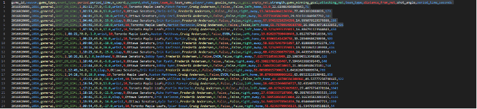

## Introduction: How to Predict a Goal? 

Following the NHL data exploration of *Milestone 1*, we now dive deeper into the task of estimating the **quality of shots**. For this, we calculate the likelihood of  shot resulting in a goal (**Expected Goals**) based on available features, e.g. *shot type*, *distance*, *angle*, etc. others. This exercise consists of six steps:

- Step 1 introduces a first round of **feature engineering (I)** to prepare the dataset for linear regression models.  
- Step 2 runs initial tests with **linear regression**.  
- Step 3 presents a second round of **feature engineering (II)** to create advanced features for future models.  
- Step 4 tries different **hyperparameter tuning** and **feature selection** methods to determine the best parameters and features, and trains three **XGBoost** models (see Figures 4.1…). 
- Step 5 proposes the **best model** based on previous experiments.  
- Step 6 presents the **test results**.

All experiments and the most relevant models are logged on our [Weights & Biases page](https://wandb.ai/IFT6758_team4/milestone_2).

---

# **Step 1: Feature Engineering I**

## Question 1.1 : 
## Question 1.2 :
## Question 1.3 : 

<!-- .png) -->
<!-- -->
- *Figure 1.1 - *

---
# **Step 2: Baseline Models**

## Question 2.1 : 
## Question 2.2 :
## Question 2.3 : 
## Question 2.4 :

<!--  -->
<!-- -->
- *Figure 2.1 - *

---
# **Step 3: Feature Engineering II**

## Question 3.1 : 
## Question 3.2 :
## Question 3.3 : 
## Question 3.4 :
## Question 3.5 :

<!--  -->
<!-- -->
- *Figure 3.1 - *

---

# **Step 4: Advanced Models**
## Question 4.1: Baseline XGBoost classifier

<!-- -->


- *Figure 4.1 -.*

## Question 4.2: Full XGBoost classifier

<!-- -->


- *Figure 4.2.*

## Question 4.3: Optimised XGBoost classifier

---

# **Step 5: Give it your best shot!**

## Question 5.1:
## Question 5.2:



- *Figure 5.1 -*

# **Step 6: Evaluate on test set!**

## Question 6.1:
## Question 6.2:


- *Figure 6.1 -*

---

# Sources / references

